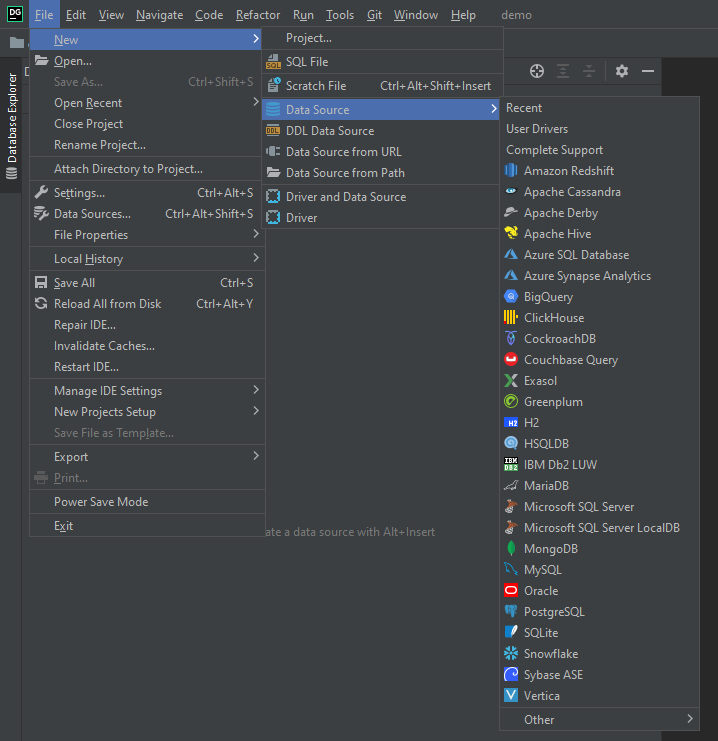
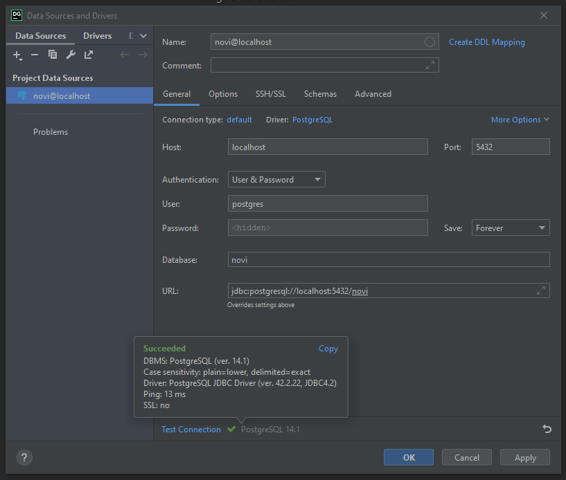
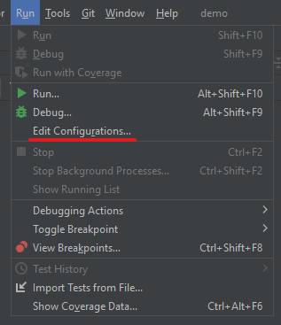
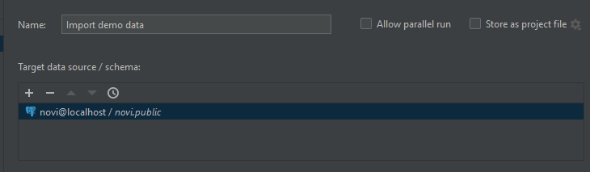
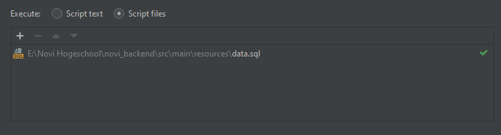
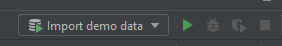

# Demo data

Na het starten van de applicatie door de stappen in de installatiehandleiding te doorlopen draait de applicatie met een
lege database. Voor het testen van de applicatie is het gewenst om testdata te importeren in de database. Dit document
bevat instructies voor het importeren van demo data in de database.

## 1. Demo data importeren

Om de demo data te kunnen importeren is het belangrijk dat de nodige tabellen al bestaat. De tabellen worden automatisch
aangemaakt bij het starten van de applicatie. Start dus eerst de applicatie voor je onderstaande stappen voor het
importeren van demo data volgt.

Het bestand `data.sql` bevat de demo data die gebruikt kan worden voor het testen van de database. Dit bestand is te
vinden op de volgende locatie `src/main/resources/data.sql`. Er zijn meerdere manieren om deze demo data te importeren
in de PostgreSQL database. In dit document staan instructies voor het importeren van deze data
middels [Jetbrains Datagrip](https://www.jetbrains.com/datagrip/)

1. Open Datagrip en maak een nieuw project.
2. Voeg een nieuwe PostgreSQL datasource toe aan het project middels `file -> new -> datasource -> PostgreSQL`
   
3. Vul de credentials van de PostgresSQL database in en klik op `Test Connection`
4. Indien de credentials kloppen klik je op `Apply` en daarna `OK` om de datasoruce op te slaan
   
5. Voeg een script toe aan de Run/Debug configurations via `Run -> Edit Configurations`
   
6. Klik op het plusje links boven en selecteer de optie `Database script`
7. Geef een naam aan de configuration, bijvoorbeeld "Import demo data"
8. Klik op het plusje onder Target data source / schema en selecteer de bij stap 4 toegevoegde database
   
9. Selecteer de optie `Script files` i.p.v. `Script text`
10. Klik op het plusje en selecteer het bestand `data.sql` in `src/main/resources/data.sql`
    
11. Sla de configuratie op door op `Apply` en vervolgens `OK` te klikken
12. Selecteer de configuratie en klik vervolgens op het 'run' icoontje (groene play icon) 
    

Na het uitvoeren van bovenstaande 12 stappen is de demo data uit `data.sql` geïmporteerd in de database.

## 2. Demo credentials

De demo data bevat onder andere meerdere werknemers met verschillende rollen om de applicatie te kunnen testen. De
credentials zijn in onderstaande tabel te vinden.

| **email**                          | **wachtwoord** | **rol**                   |
|------------------------------------|----------------|---------------------------|
| `bertus.bick@novi-garage.nl`       | `hm4&sE83`     | admin                     |
| `joep.kamphuis@novi-garage.nl`     | `s69#5Lzk`     | administratief medewerker |
| `arend.de.porter@novi-garage.nl`   | `LG7Ef$tj`     | backoffice medewerker     |
| `anton.van.neste@novi-garage.nl`   | `kLQK74!?`     | monteur                   |
| `natalie.westhoven@novi-garage.nl` | `#6HD9bMH`     | kassamedewerker           |