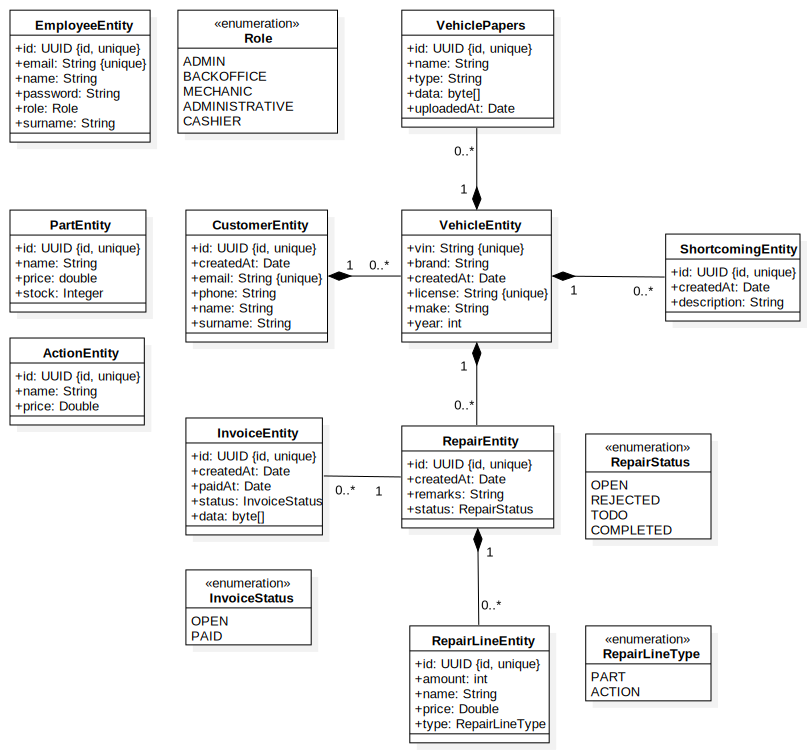
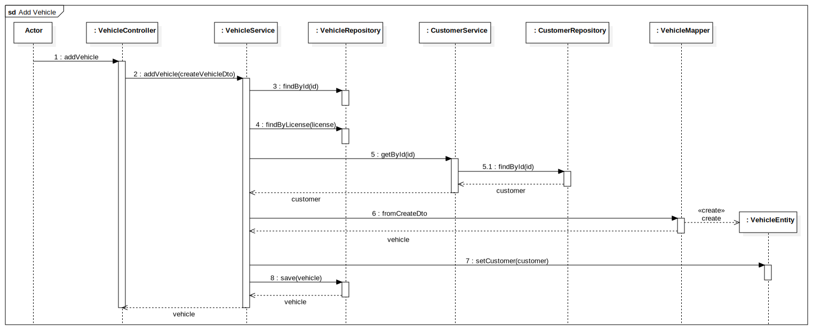
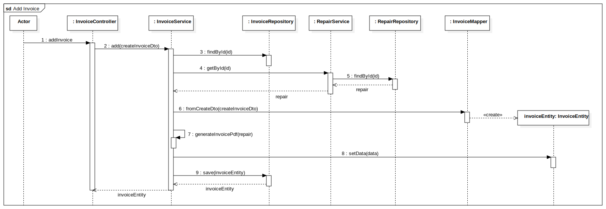

# Deelopdracht 1. Technisch Ontwerp

In dit document staat het technisch ontwerp voor deelopdracht 1 beschreven. Het technisch ontwerp bevat de volgende
onderdelen:

1. [Opdrachtomschrijving](#1-opdrachtomschrijving)
2. [User stories](#2-user-stories)
3. [Klassendiagram](#3-klassendiagram)
    1. [Kandidaat klassen en beslissingen](#31-kandidaat-klassen-en-beslissingen)
    2. [Modeldictionary](#32-modeldictionary)
    3. [UML Klassendiagram](#33-uml-klassendiagram)
4. [Sequentiediagrammen](#4-sequentiediagrammen)
    1. [Voertuig toevoegen diagram](#41-voertuig-toevoegen-diagram)
    2. [Factuur genereren diagram](#42-factuur-genereren-diagram)

## 1. Opdrachtomschrijving

Voor mijn eindopdracht ga ik het backend systeem van een autogarage programmeren. In deze garage komen klanten hun auto
afleveren voor een reparatie. Een administratief medewerker voegt de klant en de auto toe aan het systeem wanneer de
klant en/of de auto voor het eerst bij de garage komen. Tijdens de registratie kunnen de autopapieren in pdf-formaat
toegevoegd worden.

Een monteur keurt vervolgens de auto en voegt de gevonden tekortkomingen toe aan de auto in het systeem. Nadat de auto
gekeurd is, neemt de monteur contact op met de klant.

Gaat de klant niet akkoord met de reparatie dan zet de monteur dat in het systeem, voegt hij de handeling keuring à 45
euro toe aan de reparatie, wordt de reparatie op 'niet uitvoeren' gezet en maakt een kassamedewerker bij het ophalen van
de auto een factuur.

Wanneer de klant akkoord gaat, voegt de monteur toe wat afgesproken is en gaat hij de auto repareren. Elk onderdeel dat
gebruikt wordt, wordt toegevoegd aan de reparatie. Ook wordt elke handeling gedocumenteerd. Vervangt de monteur
bijvoorbeeld de remschijf dan wordt het onderdeel remschijf aan de reparatie toegevoegd en wordt de handeling ‘remschijf
vervangen’ aan de reparatie toegevoegd.

Al deze onderdelen en handelingen staan al, inclusief prijs, in het systeem. De monteur kan deze opgeslagen handelingen
en onderdelen selecteren. Omdat een monteur soms iets specifieks moet doen, kan de monteur ook een 'overige' handeling
en prijs toevoegen.

Wanneer de reparatie voltooid is, wordt de reparatie op voltooid gezet en kan de klant worden opgebeld door een
administratief medewerker. Deze medewerker kan een lijst opvragen met te bellen klanten waarvan de reparatie voltooid is
of de status 'niet uitvoeren' is.

Wanneer de klant de auto komt ophalen, zal een kassamedewerker de factuur laten genereren door het systeem. De factuur
bevat de keuring + bedrag, de handelingen + bedrag en de onderdelen + bedrag. De bedragen op de factuur zijn exclusief
BTW, deze staat onderaan op de factuur vermeld. Wanneer de klant betaald heeft, wordt de status van de factuur op
betaald gezet.

Daarnaast is er een backoffice medewerker die onderdelen (naam, prijs, voorraad) kan toevoegen aan het systeem,
voorraden kan aanpassen en reparatiehandelingen (naam, prijs) kan toevoegen aan het systeem. Alle prijzen in het systeem
zijn exclusief BTW.

## 2. User stories

Uit de opdrachtomschrijving zijn concrete user stories te herleiden. De verschillende user stories staan hieronder
beschreven

1. Als administratief medewerker wil ik een klant kunnen toevoegen aan het systeem zodat de gegevens in het systeem
   staan
2. Als administratief medewerker wil ik de gegevens van één of meerdere klanten kunnen opvragen zodat ik de juiste
   gegevens kan bekijken wanneer ik deze nodig heb
3. Als administratief medewerker wil de gegevens van een klant in het systeem kunnen bewerken zodat ik de gegevens
   up-to-date kan houden
4. Als administratief medewerker wil ik een klant kunnen verwijderen uit het systeem zodat oude klanten niet onnodig in
   het systeem blijven staan
5. Als administratief medewerker wil ik een voertuig kunnen toevoegen aan een klant in het systeem zodat ik weet welk
   voertuig bij welke klant hoort
6. Als administratief medewerker wil ik de gegevens van één of meerdere voertuigen kunnen opvragen zodat ik de juiste
   gegevens kan bekijken wanneer ik deze nodig heb
7. Als administratief medewerker wil ik de gegevens van een voertuig in het systeem kunnen bewerken zodat ik de gegevens
   up-to-date kan houden
8. Als administratief medewerker wil ik een voertuig kunnen verwijderen uit het systeem zodat oude voertuigen niet
   onnodig in het systeem blijven staan
9. Als administratief medewerker wil ik autopapieren (pdf) kunnen toevoegen aan een voertuig zodat deze gekoppeld worden
   aan het voertuig
10. Als administratief medewerker wil ik de autopapieren voor een voertuig kunnen opvragen zodat ik deze kan bekijken
    als ik deze nodig heb
11. Als monteur wil ik tekortkomingen kunnen toevoegen aan een voertuig zodat ik deze later kan terugvinden als ik het
    voertuig ga repareren
12. Als monteur wil ik de tekortkomingen van een voertuig kunnen opvragen zodat ik bij het repareren van een voertuig
    weet wat de tekortkomingen zijn
13. Als monteur wil ik tekortkomingen van een voertuig kunnen bewerken zodat ik fouten in de registratie kan herstellen
14. Als monteur wil ik tekortkomingen van een voertuig kunnen verwijderen uit het systeem zodat opgeloste tekortkomingen
    niet ontrecht bij een voertuig blijven staan
15. Als monteur wil ik de contactgegevens van de eigenaar van een voertuig kunnen opvragen zodat ik contact op kan nemen
    met de eigenaar na het keuren van een voertuig
16. Als monteur wil ik een reparatie kunnen toevoegen aan het systeem waarop ik de status en onderdelen/handelingen kan
    bijhouden
17. Als monteur wil ik één of meerdere reparaties in het systeem kunnen opvragen zodat ik de status en
    onderdelen/handelingen kan bekijken
18. Als monteur wil ik de gegevens van een reparatie kunnen bewerken zodat ik de status kan aanpassen
19. Als monteur wil ik een lijst van alle gedefinieerde onderdelen in het systeem kunnen opvragen zodat ik onderdelen
    kan toevoegen aan een reparatie
20. Als monteur wil ik een lijst van alle gedefinieerde handelingen (zoals remschijf vervangen) in het systeem kunnen
    opvragen zodat ik handelingen kan toevoegen aan een reparatie
21. Als monteur wil ik onderdelen uit een vooraf gedefinieerde lijst kunnen toevoegen aan een reparatie zodat ik weet
    welke onderdelen tijdens welke reparatie gebruikt zijn
22. Als monteur wil ik handelingen (zoals remschijf vervangen) uit een vooraf gedefinieerde lijst kunnen registreren
    zodat ik weet welke handelingen ik voor een reparatie verricht heb
23. Als monteur wil ik de mogelijkheid hebben om overige handelingen/onderdelen toe te voegen aan een reparatie om
    specifieke onderdelen/handelingen dingen die niet standaard in het systeem staan te kunnen registeren
24. Als monteur wil ik onderdelen/handelingen van een reparatie kunnen verwijderen zodat onderdelen die toch niet
    gebruikt zijn of handelingen die toch niet uitgevoerd zijn niet geregisterd blijven staan
25. Als monteur wil ik een reparatie uit het systeem kunnen verwijderen om fouten te kunnen herstellen
26. Als administratief medewerker wil ik een lijst kunnen opvragen van alle klanten waarvoor de status 'niet uitvoeren'
    of 'uitgevoerd' is zodat ik weet welke klanten ik nog moet bellen
27. Als kassamedewerker wil ik een factuur kunnen genereren voor een reparatie zodat ik deze kan meegegeven aan de klant
    bij het ophalen van een voertuig
28. Als kassamedewerker wil ik één of meerdere facturen binnen het systeem kunnen bekijken zodat ik weet wat er op een
    factuur staat en wat de status is
29. Als kassamedewerker wil ik een factuur kunnen bewerken om de status aan te passen indien de klant betaald heeft
30. Als kassamedewerker wil ik een factuur kunnen verwijderen uit het systeem om oude facturen niet onnodig in het
    systeem te laten staan
31. Als backoffice medewerker wil ik een onderdeel kunnen toevoegen aan het systeem zodat de monteur deze ziet in de
    lijst van gedefinieerde onderdelen
32. Als backofficemedewerker wil ik één of meerdere gedefinieerde onderdelen binnen het systeem kunnen opvragen zodat ik
    weet welke onderdelen er al in het systeem staan en wat de prijs en voorraad is
33. Als backofficemedewerker wil ik de gegevens van een onderdeel binnen het systeem kunnen aanpassen zodat ik prijs- of
    voorraadwijzigingen kan doorvoeren
34. Als backofficemedewerker wil ik onderdelen uit het systeem kunnen verwijderen zodat onderdeel die niet meer bestaat
    niet onnodig in het systeem blijven staan
35. Als backoffice medewerker wil ik een handeling kunnen toevoegen aan het systeem zodat de monteur deze ziet in de
    lijst van gedefinieerde handelingen
36. Als backofficemedewerker wil ik één of meerdere gedefinieerde handelingen binnen het systeem kunnen opvragen zodat
    ik weet welke handelingen er al in het systeem staan en wat de prijs en voorraad is
37. Als backofficemedewerker wik ik de gegevens van een handeling binnen het systeem kunnen aanpassen zodat ik
    prijswijzigingen kan doorvoeren
38. Als backofficemedewerker wil ik handelingen uit het systeem kunnen verwijderen zodat handelingen die niet meer
    uitgevoerd worden niet onnodig in het systeem blijven staan

## 3. Klassendiagram

Nu de opdrachtomschrijving duidelijk is en de user stories gedefinieerd zijn kan gewerkt worden aan een klassendiagram.
Eerst zijn alle mogelijke kandidaat klasse bekeken. Vervolgens is er per kandidaat klasse een blissing genomen om deze
wel/niet op te nemen in het klassendiagram. Voor de klassen waarvoor besloten is dat ze meegenomen worden in het
klassendiagram is een modeldictory gemaakt waarin per klasse een omschrijving gegeven is. Tenslotte is er een UML
klassendiagram gemaakt waarin de klassen en onderlingen relaties zichtbaar worden.

### 3.1 Kandidaat klassen en beslissingen

In onderstaande tabel staan de verschillende kandidaat klasse beschreven. Per kandidaat klasse is een beslissing genomen
over of deze wordt opgenomen in het klassendiagram. Voor sommige kandidaat klasse is besloten dat ze eigenlijk allemaal
verwijzen naar dezelfde klasse, maar met een andere naam. Dit is bijvoorbeeld het geval bij de klasse `Employee`. Zo
zijn bijvoorbeeld _"administratief medewerker"_, _"backoffice medewerker"_ en _"monteur"_ allemaal werknemers binnen de
garage. In onderstaande tabel is dat aan te geven door de beslissing _"object van klasse Employee"_. Alle 3 de soorten
medewerkers vallen binnen de klasse `Employee`.

| **Kandidaat klasse**      | **Beslissing**                         |
|---------------------------|----------------------------------------|
| administratief medewerker | object van klasse Employee             |
| auto                      | object van klasse Vehicle              |
| autopapieren              | vervangen door klasse VehiclePapers    |
| backoffice medewerker     | object van klasse Employee             |
| bedrag                    | attribuut                              |
| factuur                   | vervangen door klasse Invoice          |
| BTW tarief                | attribuut                              |
| garage                    | implementatieaspect                    |
| handeling                 | object van klasse Action               |
| kassamedewerker           | object van klasse Employee             |
| keuring                   | object van klasse Action               |
| klant                     | vervangen door klasse Customer         |
| medewerker                | vervangen door klasse Employee         |
| monteur                   | object van klasse Employee             |
| naam                      | attribuut                              |
| onderdeel                 | vervangen door klasse Part             |
| overige handelingen       | object van klasse Action               |
| prijs                     | attribuut                              |
| registratie               | operatie                               |
| remschijf                 | object van klasse Part                 |
| reparatie                 | object van klasse Repair en RepairLine |
| reparatiehandeling        | object van klasse Action               |
| status                    | attribuut                              |
| systeem                   | implementatieaspect                    |
| tekortkomingen            | vervangen door klasse Shortcoming      |
| voorraad                  | attribuut                              |

### 3.2 Modeldictionary

Nu voor elke kandidaat klasse een blissing is genomen is duidelijke welke klassen onderdeel gaan uitmaken van het
klassendiagram.

| **Klasse**    | **Omschrijving**                                                                                                                         |
|---------------|------------------------------------------------------------------------------------------------------------------------------------------|
| Customer      | Een fysiek persoon die ooit een overeenkomst aangegaan is met de garage door bijvoorbeeld het laten keuren of repareren van een voertuig |
| Employee      | Een werknemer van de garage. Elke werknemer heeft een eigen rol, bijvoorbeeld administratief medewerker of monteur                       |
| Action        | Een handeling die door een monteur uitgevoerd kan worden zoals bijvoorbeeld het vervangen van een remschijf                              |
| Part          | Een onderdeel van een voertuig die door een monteur vervangen zou kunnen worden zoals een remschijf                                      |
| Repair        | Een verzameling van alle door de monteur verrichte handelingen en vervangen onderdelen                                                   |
| RepairLine    | Eén losse regel om een handeling of onderdeel te representeren. De regel is altijd gekoppeld aan een reparatie                           |
| Invoice       | Een factuur waarop de verschillende verrichte handelingen en vervangen onderdelen staan. Op de factuur staat ook het BTW tarief vermeld  |
| Shortcoming   | Een beschrijving van een door een monteur gevonden tekortkoming aan een voertuig, zoals kapotte lampen of een versleten remblok          |
| Vehicle       | Een object dat een voertuig van een klant representeert, bijvoorbeeld een auto of motor                                                  |
| VehiclePapers | Een pdf bestand met daarin informatie over een voertuig                                                                                  |

### 3.3 UML Klassendiagram

In het klassendiagram is ervoor gekozen om alle klassen die uiteindelijk opgeslagen worden in de database de suffix
`Entity` te geven. 

## 4. Sequentiediagrammen

De te ontwikkelen applicatie kent een gelaagde architectuur. Elke klasse binnen de applicatie is verantwoordelijk voor
een specifieke taak. Om de verschillende architecturele lagen binnen de applicatie inzichtelijk te maken zijn 2
sequentiediagrammen gemaakt. Deze diagrammen geven de interacties tussen verschillende lagen in de applicatie aan.

Per diagram is ook nog een beschrijving gegeven van de achterliggende gedacht achter het diagram.

### 4.1 Voertuig toevoegen diagram

Bij het toevoegen van een voertuig dienen er een aantal dingen te gebeuren. Aangezien de velden `id` en `license` voor
een voertuig uniek zijn dient eerst gekeken te worden of er niet al een voertuig bestaat binnen het systeem met het
gegeven id of kenteken. In het sequentiediagram is het scenario waarin het id of kenteken niet uniek is niet meegenomen.
Wel zijn de aanroepen naar `findById` en `findByLicense` meegenomen in het diagram.

Na het controleren van het id en kenteken dient te worden gecontroleerd of er een klant bestaat met het opgegeven id.
Indien dit niet get geval is, zou het voertuig niet gekoppeld kunnen worden aan een klant en dient de app een
foutmelding terug te geven. In het diagram is het scenario waarin de klant niet bestaat niet meegenomen. Wel is de
aanroep naar
`findById` op de `CustomerService` meegenomen.

Als de validatie van de input gedaan is kan de input omzet worden van een DTO naar de daadwerkelijke entity model.
Hiervoor wordt gebruikt gemaakt van een mapper die alleen als taak heeft het omzetten van een DTO naar model en het
updaten van een model op basis van een DTO.

Na het mappen wordt het veld customer gezet middels de setter en kan de model opgeslagen worden in de database.

### 4.2 Factuur genereren diagram
Net als bij het toevoegen van een voertuig wordt eerst gekeken of er niet al een entity bestaat met het id. Hiervoor
wordt de `findById` functie op de `InvoiceRepostitory` gebruikt. Indien er al een `InvoiceEntity` bestaat met het
opgegeven id gooit de service een `EntityAlreadyExistsException`, dit is niet opgenomen in het sequence diagram.

Een factuur wordt gegenereerd op basis van de `RepairEntity` model. De eerste stap is daarom om de `RepairEntity` met het
gegeven id op te halen uit de database. Indien een `RepairEntity` met het id niet bestaat, dient de app een foutmelding
terug te geven. Dit scenario is niet opgenomen in het diagram, maar de aanroep naar `getById` op de `RepairService`
wel.

Als de `RepairEntity` geladen is uit de database is het aan de `InvoiceService` om een pdf te genereren. Eerst wordt de
`fromCreateDto` aangeroepen om een instantie van een `InvoiceEntity` te maken. Vervolgens wordt de `RepairEntity`
gebruikt om een pdf te genereren middels de `generateInvoicePdf` functie. De gengenereerde pdf wordt als byte array
opgeslagen in de data attribute van `RepairEntity`. Tenslotte wordt de `InvoiceEntity` opgeslagen middels de `save`
functie op de `InvoiceRepository`.

